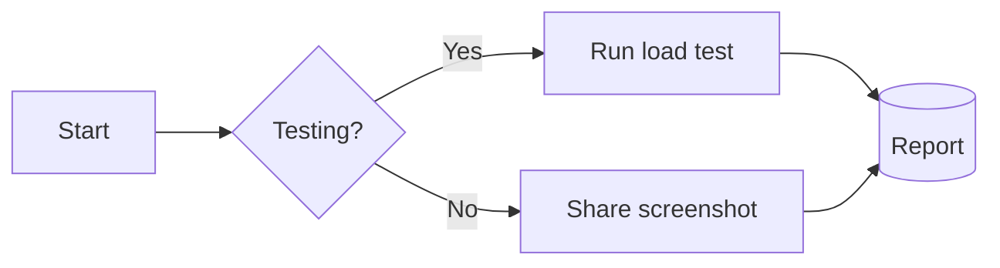
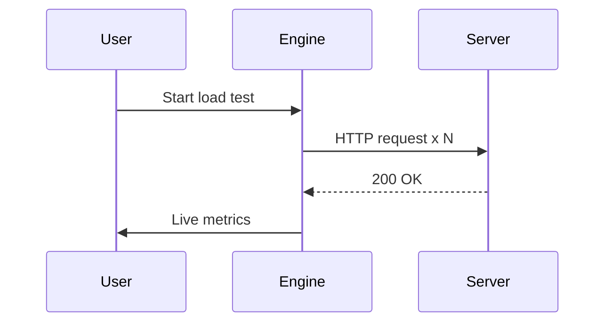
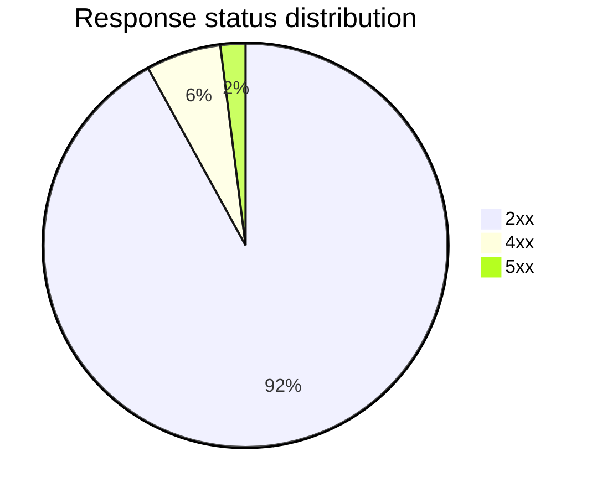

# Markdown Rendering Demo

Supports **GFM** (tables, task lists, strikethrough), syntax highlighting, math formulas, and **Mermaid diagrams**.

## Mermaid Diagrams

> Hover any diagram and click the button in its top-right corner to export it as a PNG image.

### Flowchart



### Sequence diagram



### Pie chart



## Table

| Method | Route | P95 latency |
| --- | --- | --- |
| GET | /api/users | 84 ms |
| POST | /api/orders | 132 ms |

- [x] Build the load test engine
- [x] Ship 18 built-in developer tools
- [ ] Go global

## Code highlighting

```ts
export function greet(name: string): string {
  return `Hello, ${name}!`;
}
```

## Math

Inline math $E = mc^2$, and a display equation:

$$
P(A \mid B) = \frac{P(B \mid A)\,P(A)}{P(B)}
$$

> Tip: write `mermaid` as the language of a code block to draw any diagram.