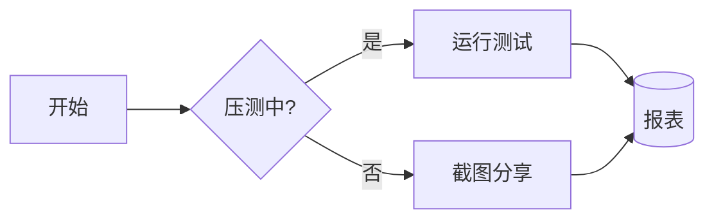
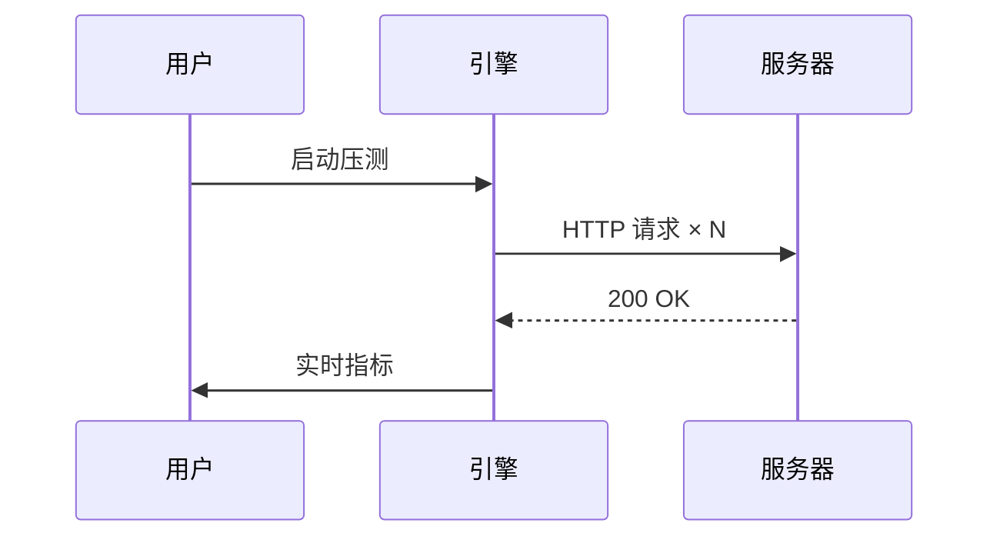
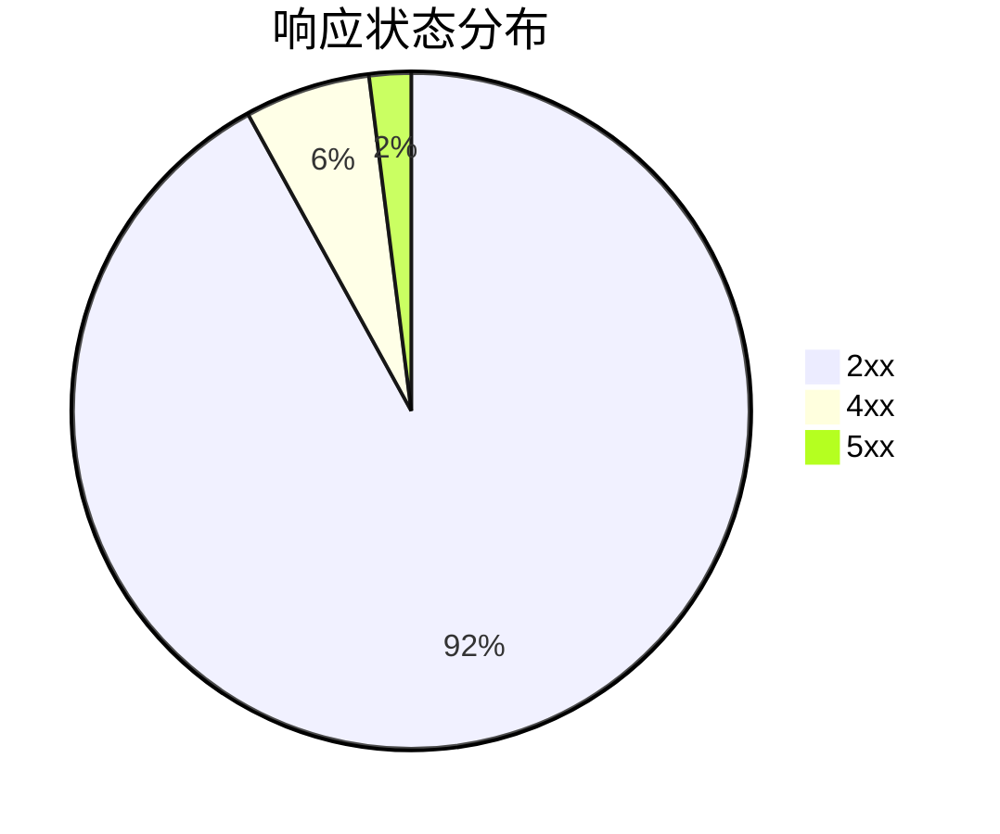

# Markdown 渲染演示

支持 **GFM**（表格、任务列表、删除线）、代码高亮、数学公式，以及 **Mermaid 图表**。

## Mermaid 图表

> 悬停任意图表，点击右上角按钮即可导出为 PNG 图片。

### 流程图



### 时序图



### 饼图



## 表格

| 方法 | 路由 | P95 延迟 |
| --- | --- | --- |
| GET | /api/users | 84 ms |
| POST | /api/orders | 132 ms |

- [x] 完成压测引擎
- [x] 内置 18 个开发工具
- [ ] 走向世界

## 代码高亮

```ts
export function greet(name: string): string {
  return `Hello, ${name}!`;
}
```

## 数学公式

行内公式 $E = mc^2$，以及独立公式：

$$
P(A \mid B) = \frac{P(B \mid A)\,P(A)}{P(B)}
$$

> 小提示：把代码块语言写成 `mermaid`，即可绘制任意图表。